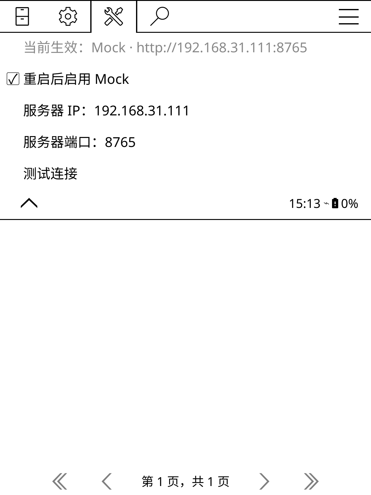
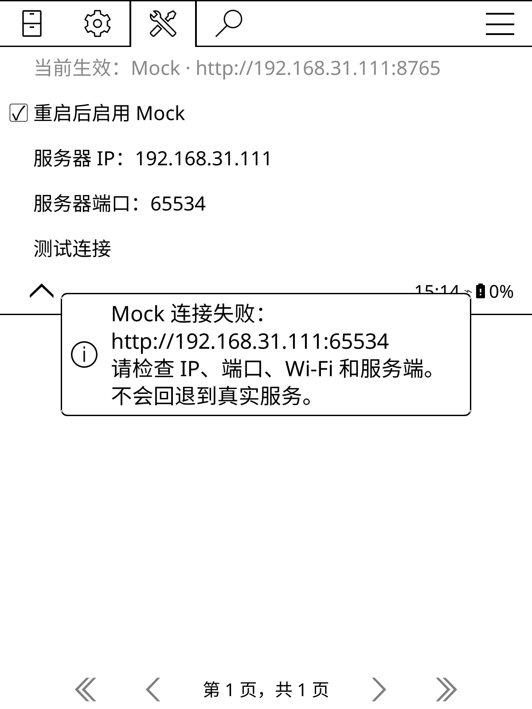

# 本地微信读书 mock 服务

用于 [macOS 发版前测试](macos-release-testing.md)。只需 Python 3.10+ 标准库；真实渲染
还需要已构建的 KOReader。正式插件提供“设置 → 高级选项 → Mock 服务”，默认关闭。

插件在 Client 的 HTTP 边界将自身请求转发到指定的本地/局域网服务。协议编码、分片
MD5 校验/解码、下载器、EPUB 打包、SQLite、KOReader 控件和排版引擎仍执行真实代码。
服务不连接上游；未知接口返回 501。它验证插件对合成响应的处理，不证明真实服务协议
或账号鉴权正确，也不是进程级网络沙箱。不会替换全局 HTTP 或影响其它 KOReader 插件。

## Kindle 真机连接 Mac

Mac 与 Kindle 连同一个局域网，在 Mac 的插件仓库目录启动：

```bash
python3 scripts/mock_weread.py --bind 0.0.0.0 --port 8765
```

Kindle 安装含此功能的候选包，进入“微信读书 → 设置 → 高级选项 → Mock 服务”：

1. 服务器 IP 默认为 `192.168.31.111`，端口默认为 `8765`，均可修改。Mac 地址变动时
   填当前地址；不能在 Kindle 填 `127.0.0.1` 或 `0.0.0.0` 来代表 Mac。
2. 点击“测试连接”，应明确显示 Mock 连接成功；此动作使用所填地址，不需要先切换环境。
3. 勾选“重启后启用 Mock”，退出并重新启动 KOReader。此后入口显示“微信读书 [MOCK]”，
   使用合成账号，不需扫码。当前生效地址与待保存地址分别显示。
4. 开关或地址改变均在重启后生效；进行中的下载和后台任务不会中途换服务器。
5. 返回正常阅读时关闭开关并重启，原账号、书架、插件设置和缓存恢复可用。

连接失败只报错，不回退到真实服务；先检查 Mac 服务、Wi-Fi、地址、端口和局域网隔离。
仅接受私有 IPv4 网段 `10/8`、`172.16/12`、`192.168/16` 及本机 `127/8`。
监听地址默认仍为 `127.0.0.1`；`--bind 0.0.0.0` 显式开启局域网监听，也可只绑定 Mac
某一个 LAN IP。这里的 `0.0.0.0` 是监听参数，不是客户端连接地址。

环境选择保存在 `settings/weread-environment.lua`，测试偏好/合成账号保存在
`settings/weread-mock.lua`，数据根为 `weread-mock/`，测试收藏夹为 `weread-mock`。
真实环境仍使用原来的 `settings/weread.lua`、`weread/` 和 `weread` 收藏夹；不会复制真实
凭据到测试配置，转发请求也会移除 Cookie、Authorization 等凭据头。测试下载目录固定，
以免通过目录迁移误写真实缓存。KOReader 自己的阅读历史、界面设置不属于插件环境切换范围。

在真实 macOS KOReader 模拟器中验证的界面：

| 重启后的生效地址 | 错误端口连接失败 |
| --- | --- |
|  |  |

## 一条命令跑离屏冒烟

在插件仓库根目录执行。`--koreader` 指向**构建产物中同时含 `luajit` 和 `reader.lua`
的运行目录**，不是源码根目录。`--run-dir` 必须不存在，避免覆盖已有数据。

```bash
python3 scripts/mock_weread.py --smoke --port 0 \
    --run-dir /tmp/weread-mock-smoke-01 \
    --koreader /absolute/path/to/koreader-emulator-...-debug/koreader
```

自动完成：

1. 用现有打包脚本生成候选 ZIP，解包到独立 `profile/plugins`，写入合成账号。
2. 启动本地 HTTP 服务；在全局 HTTP 代理不可用时验证直连、书架、目录、正文、划线和想法。
3. 真实 Content 生成单章 EPUB，真实 ReaderUI 加载插件并渲染第 1/2 页截图。
4. 真实 Downloader 在 KOReader 事件循环里下载全书，校验 ZIP、六章正文和图片。
5. 成功退出 0，失败退出非 0；保存 `evidence/smoke.log`、截图、请求日志、候选 ZIP
   摘要和 `build.json`。服务随后关闭，不留下后台任务。

这是一组固定冒烟，**不等于 C01–C20 全量验收**，也不包含 ComputerUse 点击。
失败时先检查 `evidence/smoke.log`。验证未知外部地址被拦截会产生一条预期的 HTTP 501
错误日志；不要因此忽略其它错误。

不构建 KOReader 也能快速检查服务端与参考解码器：

```bash
python3 scripts/test_mock_weread.py
```

该命令已接入普通 CI；真实 KOReader 冒烟仍在本地显式执行。

## 划线想法专项回归

先用下节命令创建新的隔离目录并保持 mock 服务运行。另一终端在 KOReader 运行目录执行，
`WEREAD_PLUGIN_DIR` 为候选源码目录，`WEREAD_RUN_DIR` 为刚创建的隔离目录：

```bash
KO_HOME="$WEREAD_RUN_DIR/profile" EMULATE_READER=1 \
    EMULATE_READER_W=600 EMULATE_READER_H=800 EMULATE_READER_DPI=167 \
    ./luajit "$WEREAD_PLUGIN_DIR/spec/koreader/weread_annotations_mock.lua" \
    > "$WEREAD_RUN_DIR/evidence/annotations.log" 2>&1
```

这项测试保留真实 Client、控件、事件循环、子进程、排版和 SQLite，验证：

- 章节对应的取消与恢复、其他勾选保留、默认不勾选和“已获取”显示；
- 慢请求中暂停、迟到响应、手动续传复用断点；
- 两个预下载开关的组合、真实关书重开，以及后台续传期间翻页；
- 任一设置关闭后停止运行和排队任务、后台不可用时不退回 UI 执行；
- 界面持续读取状态时的后台 SQLite 保存、空结果重新获取及防休眠计数释放。

日志、截图保存在 `evidence/`。大屏复测使用新的隔离目录并将尺寸改为 `1072×1448`。
脚本包含故障注入，预期会记录一次“subprocess worker unavailable”；其它失败仍需排查。
它覆盖本次注释变更，不等同于全部发版用例或真实微信服务验收。

## 开窗口给 ComputerUse 点击

```bash
python3 scripts/mock_weread.py --port 8765 \
    --run-dir /tmp/weread-mock-ui-01 \
    --koreader /absolute/path/to/koreader-emulator-...-debug/koreader
```

保持服务终端运行。在另一个终端运行生成的 `/tmp/weread-mock-ui-01/launch.command`，
或让 ComputerUse 打开 `/tmp/weread-mock-ui-01/WeReadMock.app`。Mac 须解锁。
配置和下载都在该目录。启动器自动为独立 profile 配置本机地址并启用内置 mock 模式，
与真机使用同一条代码路径；账号为合成测试账号，无需微信扫码。

点击路径：

1. 文件管理器顶部标题 → 工具（扳手）→ 第 2 页 → 微信读书 → 书架。
2. 查看书架分页、分组与详情；打开“山谷来信 · 离线测试”的章节目录。
3. 下载第一章 → 立即阅读；核对中文正文、翻页、图片与原书脚注。
4. 阅读时 `F1` → 工具 → 微信读书 → 划线和想法管理 → 继续匹配。
5. 返回第 1 页，点击第一段中间的“窗外的风……” → 查看长想法并点击下一页。
6. 再按发版清单检查全书、选章、设置及故障分支。不能把点击函数返回当作通过。

探索环境中截图快捷键为 `Alt+Shift+G`，文件在 `profile/screenshots/`。
保存截图后先等截图提示消失再操作。坐标以当前截图为准，不能复用文档中的假定坐标。

不要让 GUI 与离屏冒烟共用一个正在运行的 profile。每轮新建目录，不软链开发仓库；
改动插件后重新生成候选包。KOReader 运行目录若已有另一份 `plugins/weread.koplugin`，
准备命令会拒绝继续，避免测试到错误版本。

## 故障与延迟

管理接口 `/__control` 合并更新以下字段：

| 字段 | 含义 |
| --- | --- |
| `match` | 匹配接口路径或 gateway 的 `api_name` 子串；空字符串匹配全部业务接口 |
| `delay` | 匹配请求的响应延迟，0–60 秒；超过 Client 超时可测超时分支 |
| `status` | 注入的 HTTP 错误码，400–599 |
| `times` | 失败次数；0 关闭失败、1 仅下一次、-1 持续失败 |
| `empty_shelf` / `empty_annotations` | 返回空书架 / 空划线想法，布尔值 |

例如让每个章节的首个分片慢 2 秒，便于在真实进度框点击取消：

```bash
curl --noproxy '*' -sS http://127.0.0.1:8765/__control \
    -H 'Content-Type: application/json' \
    -d '{"match":"/web/book/chapter/e_0","delay":2,"times":0}'
```

全书下载完成至少一章后取消，再下载全书。用 `evidence/requests.jsonl` 中的
`encoded_chapter` 及真实缓存文件核对已完成章节是否复用。若要一次失败：

```bash
curl --noproxy '*' -sS http://127.0.0.1:8765/__control \
    -H 'Content-Type: application/json' \
    -d '{"match":"/web/book/chapter/e_0","delay":0,"status":503,"times":1}'
```

插件可能自动重试；一次失败后成功正是该设置的预期。用 `times:-1` 测持续失败，
恢复全部正常行为：

```bash
curl --noproxy '*' -sS http://127.0.0.1:8765/__control \
    -H 'Content-Type: application/json' \
    -d '{"match":"","delay":0,"status":503,"times":0,"empty_shelf":false,"empty_annotations":false}'
curl --noproxy '*' -sS http://127.0.0.1:8765/__state
```

`/__state` 包含当前开关、最近 500 次请求与合成阅读进度。完整请求日志写入 JSONL，
不记录 Cookie/Authorization、请求正文或私人数据。修改开关仅影响此后进入处理的请求；
已开始等待的请求保持原有延迟，适合验证取消后的迟到响应。

停止服务用 `Ctrl-C`；窗口关闭后可保留整个目录作为报告证据。如果复用已创建的 GUI
配置，只重启同端口服务，不再传 `--run-dir`：

```bash
python3 scripts/mock_weread.py --port 8765 --log /tmp/weread-mock-ui-01/evidence/requests.jsonl
```

服务重启会重置故障开关和合成远端进度；本地 profile 的设置、数据库和下载仍保留。

## 当前覆盖边界

- 已有：26 本自写合成书、3 个分组、6 章 XHTML、e_0/e_1/e_3 与 e_2 编码分片、PNG
  封面/插图、原书脚注、每章 1 条划线、长想法、简单回复、书评、搜索、进度读写。
- 已实测：真实 HTTP/解码/整本下载/文件完整性/离屏渲染；ComputerUse 书架、目录、
  单章下载、开书、划线匹配、想法弹窗及分页。
- 尚未提供：扫码与续期、公众号、阅读统计、更新器、复杂分组层级、不同账号数据、
  多批划线、TXT/损坏分片/资源归档等完整夹具。未知接口明确报错，不伪造成功。
- 延迟和错误开关可辅助取消/续传测试，但不会自动执行这些 UI 用例。按发版清单
  实际执行并保留证据，缺失场景仍记 BLOCKED。

新增 fixture 优先扩展 `scripts/mock_weread.py` 的现有响应，并添加能失败的契约检查。
不要替掉被测 Downloader、UIManager、文档或排版引擎，也不要把合成数据视作线上协议样本。
