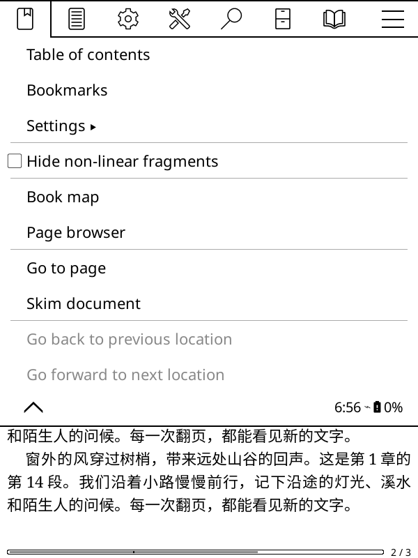
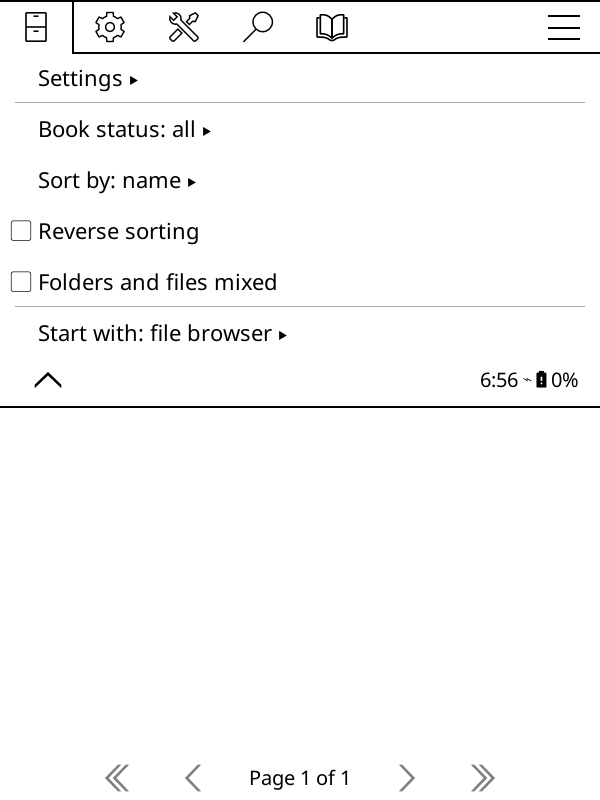
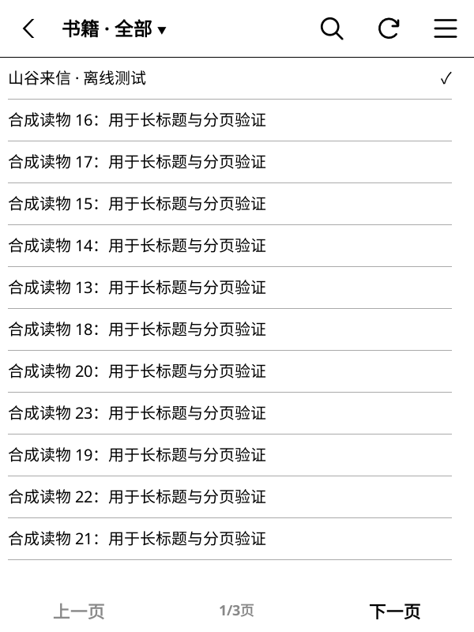

# v1.5.8 validation — 2026-09-26

Scope: a book icon in KOReader's top menu bar opens the WeRead bookshelf
directly, in both ReaderUI and FileManager. The existing plugin submenu stays
available. The action tab is not remembered as the last selected tab.

- PASS: all 78 Lua specs; coverage includes installation, menu rebuilds,
  duplicate prevention, preserving custom tab order, deferred opening, and
  closing the main menu before opening the bookshelf.
- PASS: static analysis (167 files, zero warnings/errors), plus recheck of
  version files and the extended real-KOReader smoke script.
- PASS: candidate ZIP integrity, changelog extraction, and whitespace checks.
- PASS: real Linux KOReader offscreen rendering with an isolated candidate.
  Both ReaderUI and FileManager use their real TouchMenu tab selection path;
  assertions verify the menu closes and the real WeRead shelf view opens.
  Synthetic book download, rendering, page turns and full EPUB also pass.
  Evidence: `/tmp/weread-158-smoke-both/evidence/`.
- PENDING: remote CI, pinned PluginLoader integration and automatic release
  checks for the pushed commit.
- BLOCKED: full macOS window/ComputerUse acceptance and Kindle hardware
  testing, unavailable in this Linux environment. Offscreen rendering does
  not establish physical touch accuracy or hardware acceptance.

Release follows the user's existing push-and-publish instruction with these
environment limitations recorded.

## Offscreen screenshots (synthetic data)

The open-book icon immediately before the final menu icon is the new entry.

